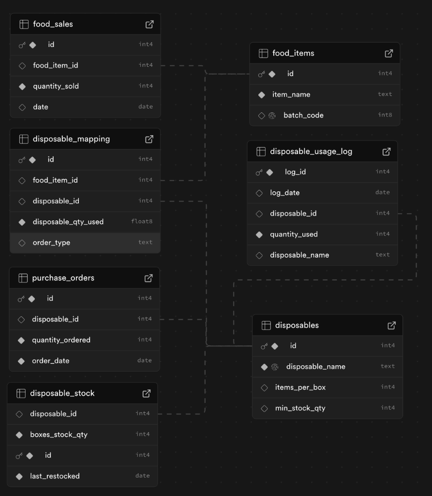
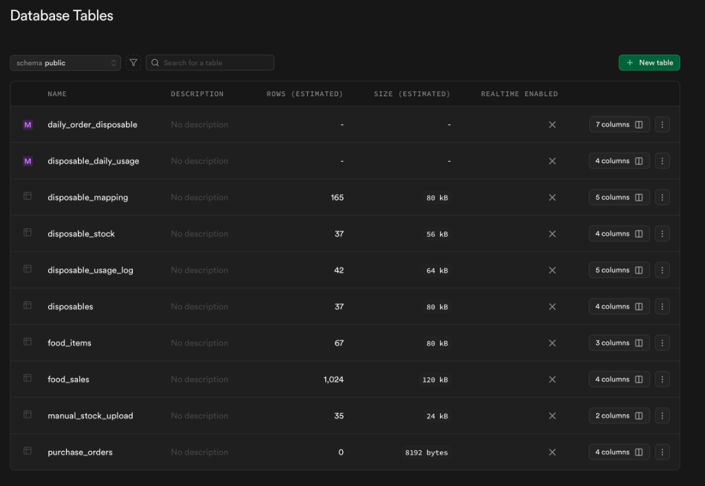
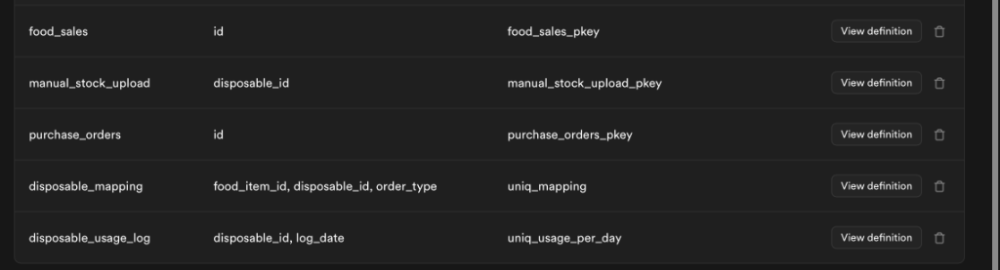
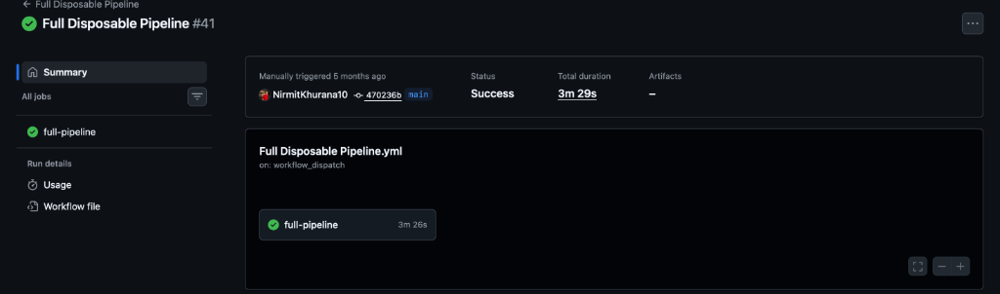

<a name="readme-top"></a>

<!-- PROJECT LOGO -->
<br />
<div align="center">
  <a href="https://github.com/NirmitKhurana10/Operational-Waste-Mitigation-Demand-Forecasting-Engine">
    
  </a>

  <h3 align="center">Operational Waste Mitigation & Demand Forecasting Engine</h3>

  <p align="center">
    An intelligent, automated system for tracking food sales, managing disposable inventory, and optimizing supply chain operations through data-driven demand forecasting.
    <br />
    <a href="#about-the-project"><strong>Explore the docs »</strong></a>
    <br />
    <br />
    <a href="#usage">View Demo</a>
    ·
    <a href="https://github.com/NirmitKhurana10/Operational-Waste-Mitigation-Demand-Forecasting-Engine/issues">Report Bug</a>
    ·
    <a href="https://github.com/NirmitKhurana10/Operational-Waste-Mitigation-Demand-Forecasting-Engine/issues">Request Feature</a>
  </p>
</div>

<!-- TABLE OF CONTENTS -->
<details>
  <summary>Table of Contents</summary>
  <ol>
    <li>
      <a href="#about-the-project">About The Project</a>
      <ul>
        <li><a href="#built-with">Built With</a></li>
      </ul>
    </li>
    <li><a href="#key-features">Key Features</a></li>
    <li><a href="#system-architecture">System Architecture</a></li>
    <li><a href="#database-schema">Database Schema</a></li>
    <li>
      <a href="#getting-started">Getting Started</a>
      <ul>
        <li><a href="#prerequisites">Prerequisites</a></li>
        <li><a href="#installation">Installation</a></li>
      </ul>
    </li>
    <li><a href="#usage">Usage</a></li>
    <li><a href="#automation-pipeline">Automation Pipeline</a></li>
    <li><a href="#contact">Contact</a></li>
  </ol>
</details>

<!-- ABOUT THE PROJECT -->
## About The Project

The **Operational Waste Mitigation & Demand Forecasting Engine** is an enterprise-grade automation system designed to eliminate operational inefficiencies in food service operations. Built for IKEA's disposable management operations, this system transforms raw sales data into actionable insights while maintaining real-time inventory control.

**The Problem:**
- Manual tracking of disposable item usage leads to stockouts and over-ordering
- No correlation between food sales and disposable consumption
- Reactive inventory management resulting in operational waste
- Time-consuming manual data entry and reconciliation

**The Solution:**
This engine automates the entire workflow from data ingestion to inventory optimization:
- 📊 **Automated Data Processing**: Ingests daily sales reports and transforms them into structured data
- 🔄 **Real-time Inventory Tracking**: Automatically updates stock levels based on actual usage
- 📈 **Demand Forecasting**: Analyzes consumption patterns to predict future needs
- ⚡ **Zero Manual Intervention**: Fully automated GitHub Actions pipelines running on schedule
- 🎯 **Waste Reduction**: Data-driven ordering prevents both stockouts and excess inventory

<p align="right">(<a href="#readme-top">back to top</a>)</p>

### Built With

This project leverages modern cloud infrastructure and Python's data processing ecosystem:

* [![Python][Python-badge]][Python-url]
* [![Pandas][Pandas-badge]][Pandas-url]
* [![Supabase][Supabase-badge]][Supabase-url]
* [![GitHub Actions][Actions-badge]][Actions-url]
* [![PostgreSQL][PostgreSQL-badge]][PostgreSQL-url]

<p align="right">(<a href="#readme-top">back to top</a>)</p>

<!-- KEY FEATURES -->
## Key Features

### 🔄 Automated Data Pipeline
- **Daily Sales Ingestion**: Automatically downloads Excel sales reports from Supabase Storage
- **Data Cleaning & Transformation**: Removes duplicates, validates data, and normalizes formats
- **Intelligent Mapping**: Links sales data to food items and disposables using batch codes

### 📦 Inventory Management
- **Real-time Stock Updates**: Automatically deducts disposables based on food sales patterns
- **Purchase Order Tracking**: Maintains historical records of all disposable orders
- **Low Stock Alerts**: Database views identify items requiring restock

### 📊 Analytics & Reporting
- **Materialized Views**: Pre-computed daily usage summaries for instant reporting
- **Historical Logging**: Complete audit trail of all disposable consumption
- **Performance Optimization**: Indexed queries for sub-millisecond response times

### ⚙️ Automation & Reliability
- **Scheduled Workflows**: GitHub Actions run daily at predetermined intervals
- **Error Handling**: Comprehensive logging and exception management
- **Idempotent Operations**: Upsert operations prevent duplicate records

<p align="right">(<a href="#readme-top">back to top</a>)</p>

<!-- SYSTEM ARCHITECTURE -->
## System Architecture

The system follows a three-stage pipeline architecture:

```mermaid
graph LR
    A[Excel Sales Report] -->|Daily Upload| B[Supabase Storage]
    B -->|Download| C[Data Cleaning Script]
    C -->|Transform| D[Clean CSV]
    D -->|Upload| E[Supabase Storage]
    D -->|Insert| F[food_sales Table]
    F -->|Trigger| G[disposable_mapping]
    G -->|Calculate| H[disposable_daily_usage View]
    H -->|Log| I[disposable_usage_log]
    I -->|Execute| J[Stock Update Procedure]
    J -->|Update| K[disposable_stock]
    K -->|Generate| L[Purchase Orders]
    
    style A fill:#e3f2fd
    style B fill:#fff3e0
    style F fill:#f3e5f5
    style K fill:#e8f5e9
    style L fill:#fce4ec
```



### Data Flow

1. **Ingestion Phase**: `insert_food_sales.py` downloads daily Excel reports
2. **Processing Phase**: Data is cleaned, validated, and mapped to food items
3. **Analysis Phase**: Disposable usage is calculated based on food-to-disposable ratios
4. **Execution Phase**: Stock levels are updated and purchase recommendations generated

<p align="right">(<a href="#readme-top">back to top</a>)</p>

<!-- DATABASE SCHEMA -->
## Database Schema

### Entity Relationship Diagram

The database is hosted on **Supabase** (PostgreSQL) and consists of 9 core tables with optimized indexing:



### Core Tables

#### 📋 **food_items**
Stores menu items with unique batch codes for sales tracking.

#### 💰 **food_sales**
Daily sales records linked to food items. Primary driver for disposable consumption.

#### 🍽️ **disposables**
Master catalog of all disposable items (plates, cups, utensils, etc.) with inventory thresholds.

#### 🔗 **disposable_mapping**
Junction table linking food items to required disposables with usage ratios.
- Example: 1 "Meatball Platter" requires 1 plate + 1 fork + 1 knife

#### 📊 **disposable_daily_usage** (Materialized View)
Real-time calculation of today's disposable consumption.

#### 📝 **disposable_usage_log**
Historical archive of daily disposable usage for trend analysis.

#### 📦 **disposable_stock**
Current inventory levels with last restock date tracking.

#### 🛒 **purchase_orders**
Generated orders for disposables based on demand forecasts.

### Database Tables Overview



### Performance Optimization

The system uses strategic indexing for optimal query performance:


**Key Indexes:**
- `food_items_batch_code_key`: Fast batch code lookups during sales processing
- `disposables_disposable_name_key`: Unique constraint ensuring data integrity
- `uniq_usage_per_day`: Prevents duplicate daily logs
- `uniq_mapping`: Ensures one-to-one food-to-disposable mappings



<p align="right">(<a href="#readme-top">back to top</a>)</p>

<!-- GETTING STARTED -->
## Getting Started

Follow these steps to set up the project locally or deploy to your own environment.

### Prerequisites

* Python 3.8 or higher
  ```sh
  python --version
  ```

* Supabase Account
  - Create a free account at [supabase.com](https://supabase.com)
  - Create a new project and note your project URL and API key

### Installation

1. Clone the repository
   ```sh
   git clone https://github.com/NirmitKhurana10/Operational-Waste-Mitigation-Demand-Forecasting-Engine.git
   ```

2. Navigate to project directory
   ```sh
   cd Operational-Waste-Mitigation-Demand-Forecasting-Engine
   ```

3. Install Python dependencies
   ```sh
   pip install -r requirements.txt
   ```

4. Create a `.env` file in the root directory
   ```env
   SUPABASE_URL=your_supabase_project_url
   SUPABASE_KEY=your_supabase_anon_key
   ```

5. Set up Supabase database schema
   - Import the database schema (SQL scripts can be provided separately)
   - Create storage buckets:
     - `daily-sales` (for raw Excel files)
     - `clean-daily-sales` (for processed CSV files)

6. Configure GitHub Actions (for automated execution)
   - Go to your repository Settings → Secrets and variables → Actions
   - Add secrets:
     - `SUPABASE_URL`
     - `SUPABASE_KEY`

<p align="right">(<a href="#readme-top">back to top</a>)</p>

<!-- USAGE -->
## Usage

### Manual Execution

Run individual scripts for testing or manual processing:

**Process daily food sales:**
```bash
python scripts/insert_food_sales.py
```

**Refresh disposable usage view:**
```bash
python scripts/refresh_daily_disposable_usage_view.py
```

**Log disposable usage and update stock:**
```bash
python scripts/disposable_logger.py
```

**Generate purchase orders:**
```bash
python scripts/refresh_final_order_view.py
```

### Automated Execution via GitHub Actions

The pipeline runs automatically every day via GitHub Actions:



**Workflow Schedule:**
- Runs daily at a configured time
- Total execution time: ~3 minutes
- Zero manual intervention required

<p align="right">(<a href="#readme-top">back to top</a>)</p>

<!-- AUTOMATION PIPELINE -->
## Automation Pipeline

### Workflow Overview

The GitHub Actions workflow executes four sequential jobs:

```yaml
Schedule: Daily (Cron-based)
├── Job 1: Insert Food Sales (insert_food_sales.py)
│   ├── Download yesterday's sales Excel
│   ├── Clean and transform data
│   ├── Upload cleaned CSV
│   └── Insert records to database
│
├── Job 2: Refresh Daily Usage View (refresh_daily_disposable_usage_view.py)
│   └── Execute stored procedure to calculate today's usage
│
├── Job 3: Log Usage & Update Stock (disposable_logger.py)
│   ├── Read disposable_daily_usage view
│   ├── Insert into disposable_usage_log
│   └── Execute stock deduction procedure
│
└── Job 4: Generate Purchase Orders (refresh_final_order_view.py)
    └── Calculate and create orders for low-stock items
```

### Key Features

- **Idempotency**: All operations use upsert logic to prevent duplicates
- **Error Handling**: Comprehensive try-catch blocks with detailed logging
- **Time Zone Awareness**: Uses Toronto timezone for date calculations
- **Wait Mechanisms**: 60-second delays ensure database consistency

<p align="right">(<a href="#readme-top">back to top</a>)</p>

<!-- CONTACT -->
## Contact

**Nirmit Khurana**

[![LinkedIn][linkedin-shield]][linkedin-url]
[![GitHub][github-shield]][github-url]

Project Link: [https://github.com/NirmitKhurana10/Operational-Waste-Mitigation-Demand-Forecasting-Engine](https://github.com/NirmitKhurana10/Operational-Waste-Mitigation-Demand-Forecasting-Engine)

<p align="right">(<a href="#readme-top">back to top</a>)</p>

---

<div align="center">
  <p>Built with ❤️ for operational excellence and sustainability</p>
  <p>
    
    
    
    
  </p>
</div>

<!-- MARKDOWN LINKS & IMAGES -->
[linkedin-shield]: https://img.shields.io/badge/-LinkedIn-black.svg?style=for-the-badge&logo=linkedin&colorB=0077B5
[linkedin-url]: https://www.linkedin.com/in/nirmit-khurana/
[github-shield]: https://img.shields.io/badge/-GitHub-black.svg?style=for-the-badge&logo=github&colorB=181717
[github-url]: https://github.com/NirmitKhurana10

[Python-badge]: https://img.shields.io/badge/Python-3776AB?style=for-the-badge&logo=python&logoColor=white
[Python-url]: https://www.python.org/
[Pandas-badge]: https://img.shields.io/badge/Pandas-150458?style=for-the-badge&logo=pandas&logoColor=white
[Pandas-url]: https://pandas.pydata.org/
[Supabase-badge]: https://img.shields.io/badge/Supabase-3ECF8E?style=for-the-badge&logo=supabase&logoColor=white
[Supabase-url]: https://supabase.com/
[Actions-badge]: https://img.shields.io/badge/GitHub_Actions-2088FF?style=for-the-badge&logo=github-actions&logoColor=white
[Actions-url]: https://github.com/features/actions
[PostgreSQL-badge]: https://img.shields.io/badge/PostgreSQL-316192?style=for-the-badge&logo=postgresql&logoColor=white
[PostgreSQL-url]: https://www.postgresql.org/
